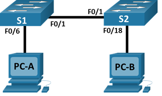
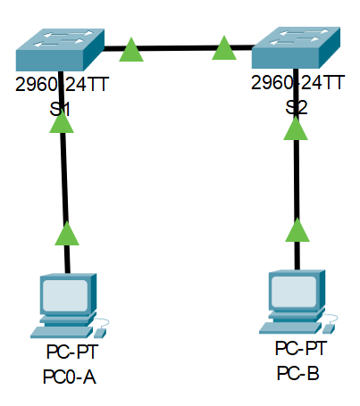
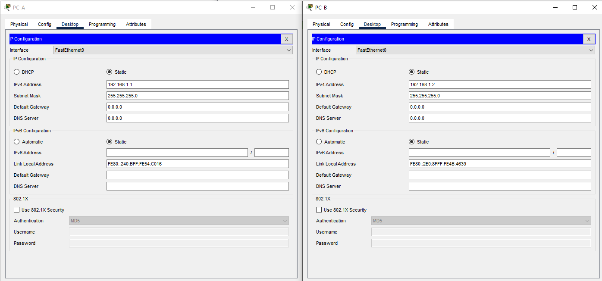
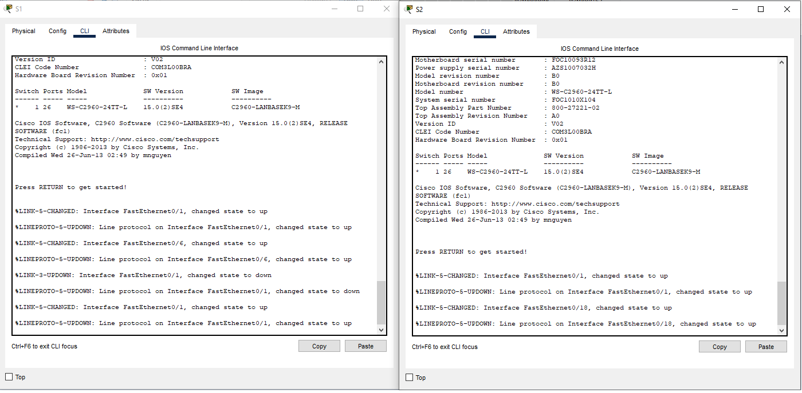
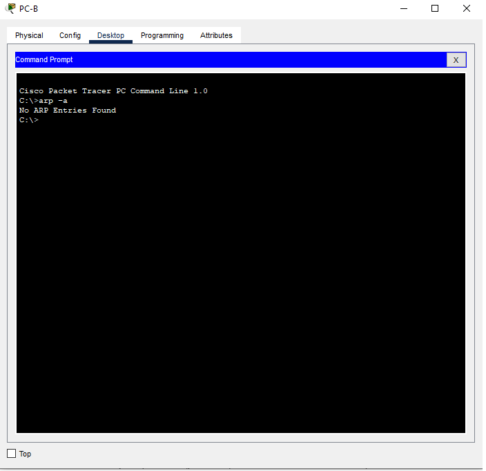

# Лабораторная работа. Просмотр таблицы MAC-адресов коммутатора

# Топология



# Таблица адресации

| Устройство | Интерфейс | IP-адрес | Маска подсети |
| --- | --- | --- | --- |
| S1  | VLAN 1 | 192.168.1.11 | 255.255.255.0 |
| S2  | VLAN 1 | 192.168.1.12 | 255.255.255.0 |
| PC-A  | NIC | 192.168.1.1 | 255.255.255.0 |
| PC-B  | NIC | 192.168.1.2 | 255.255.255.0 |


# Задачи

Часть 1. Создание и настройка сети
Часть 2. Изучение таблицы МАС-адресов коммутатора


# Часть 1. Создание и настройка сети

## Шаг 1. Подключите сеть в соответствии с топологией.


## Шаг 2. Настройте узлы ПК.




# Шаг 3. Выполните инициализацию и перезагрузку коммутаторов.
Для этого запускаем команды на каждом коммутаторе:
```shell
enable
reload
```



## Шаг 4. Настройте базовые параметры каждого коммутатора.

a.	Настройте имена устройств в соответствии с топологией.
На комутаторе S1 вводим команды
```shell
enable
configure terminal
hostname S1
end
copy run start
```
На комутаторе S2 вводим команды
```shell
enable
configure terminal
hostname S2
end
copy run start
```

b.	Настройте IP-адреса, как указано в таблице адресации.
На коммутаторе S1 (в режиме глобальной конфигурации):
```shell
S1(config)#interface vlan 1
S1(config-if)#ip address 192.168.1.11 255.255.255.0
S1(config-if)#no shutdown
end
copy run start
```
На коммутаторе S2 (в режиме глобальной конфигурации):
```shell
S1(config)#interface vlan 1
S1(config-if)#ip address 192.168.1.12 255.255.255.0
S1(config-if)#no shutdown
end
copy run start
```

c.	Назначьте cisco в качестве паролей консоли и VTY.
Для этого в консоли S1 и S2 вводим команды:

```shell
S1(config)#line console 0
S1(config-line)#password cisco
S1(config-line)#login
S1(config-line)#logging synchronous
S1(config-line)#exit
S1(config)#line vty 0 15
S1(config-line)#password cisco
S1(config-line)#login
S1(config-line)#end
S1#copy run start
```

```shell
S2(config)#line console 0
S2(config-line)#password cisco
S2(config-line)#login
S2(config-line)#logging synchronous
S2(config-line)#exit
S2(config)#line vty 0 15
S2(config-line)#password cisco
S2(config-line)#login
S2(config-line)#end
S2#copy run start
```

d.	Назначьте class в качестве пароля доступа к привилегированному режиму EXEC

На коммутаторе S1:
```shell
S1(config)#enable secret class
```

На коммутаторе S2:
```shell
S2(config)#enable secret class
```
# Часть 2. Изучение таблицы МАС-адресов коммутатора

## Шаг 1. Запишите МАС-адреса сетевых устройств.
a.	Откройте командную строку на PC-A и PC-B и введите команду:
На PC-A
```shell
ipconfig /all
```
Вывод:
```shell
C:\>ipconfig /all

FastEthernet0 Connection:(default port)

   Connection-specific DNS Suffix..: 
   Physical Address................: 0040.0B54.C016
   Link-local IPv6 Address.........: FE80::240:BFF:FE54:C016
   IPv6 Address....................: ::
   IPv4 Address....................: 192.168.1.1
   Subnet Mask.....................: 255.255.255.0
   Default Gateway.................: ::
                                     0.0.0.0
   DHCP Servers....................: 0.0.0.0
   DHCPv6 IAID.....................: 
   DHCPv6 Client DUID..............: 00-01-00-01-08-5A-3D-BB-00-40-0B-54-C0-16
   DNS Servers.....................: ::
                                     0.0.0.0
```

На PC-B
```shell
ipconfig /all
```

Вывод:
```shell
ipconfig /all

FastEthernet0 Connection:(default port)

   Connection-specific DNS Suffix..: 
   Physical Address................: 00E0.8F4B.4639
   Link-local IPv6 Address.........: FE80::2E0:8FFF:FE4B:4639
   IPv6 Address....................: ::
   IPv4 Address....................: 192.168.1.2
   Subnet Mask.....................: 255.255.255.0
   Default Gateway.................: ::
                                     0.0.0.0
   DHCP Servers....................: 0.0.0.0
   DHCPv6 IAID.....................: 
   DHCPv6 Client DUID..............: 00-01-00-01-08-5A-3D-BB-00-E0-8F-4B-46-39
   DNS Servers.....................: ::
                                     0.0.0.0

Bluetooth Connection:

   Connection-specific DNS Suffix..: 
   Physical Address................: 000A.41E7.6945
   Link-local IPv6 Address.........: ::
```

MAC-адрес компьютера PC-A: 00:40:0B:54:C0:16
MAC-адрес компьютера PC-B: 00:E0:8F:4B:46:39

b.	Подключитесь к коммутаторам S1 и S2 через консоль и введите команду show interface F0/1 на каждом коммутаторе

На коммутаторе S1:
```shell
S1#show interface fa0/1
```

Вывод:
```shell
FastEthernet0/1 is up, line protocol is up (connected)
  Hardware is Lance, address is 0060.5cc3.d801 (bia 0060.5cc3.d801)
 BW 100000 Kbit, DLY 1000 usec,
     reliability 255/255, txload 1/255, rxload 1/255
  Encapsulation ARPA, loopback not set
  Keepalive set (10 sec)
  Full-duplex, 100Mb/s
  input flow-control is off, output flow-control is off
  ARP type: ARPA, ARP Timeout 04:00:00
  Last input 00:00:08, output 00:00:05, output hang never
  Last clearing of "show interface" counters never
  Input queue: 0/75/0/0 (size/max/drops/flushes); Total output drops: 0
  Queueing strategy: fifo
  Output queue :0/40 (size/max)
  5 minute input rate 0 bits/sec, 0 packets/sec
  5 minute output rate 0 bits/sec, 0 packets/sec
     956 packets input, 193351 bytes, 0 no buffer
     Received 956 broadcasts, 0 runts, 0 giants, 0 throttles
     0 input errors, 0 CRC, 0 frame, 0 overrun, 0 ignored, 0 abort
     0 watchdog, 0 multicast, 0 pause input
     0 input packets with dribble condition detected
     2357 packets output, 263570 bytes, 0 underruns
     0 output errors, 0 collisions, 10 interface resets
     0 babbles, 0 late collision, 0 deferred
     0 lost carrier, 0 no carrier
     0 output buffer failures, 0 output buffers swapped out
```

На коммутаторе S2:
```shell
S2#show interface fa0/1
```

Вывод:

```shell
FastEthernet0/1 is up, line protocol is up (connected)
  Hardware is Lance, address is 0090.0c98.ec87 (bia 0090.0c98.ec87)
 BW 100000 Kbit, DLY 1000 usec,
     reliability 255/255, txload 1/255, rxload 1/255
  Encapsulation ARPA, loopback not set
  Keepalive set (10 sec)
  Full-duplex, 100Mb/s
  input flow-control is off, output flow-control is off
  ARP type: ARPA, ARP Timeout 04:00:00
  Last input 00:00:08, output 00:00:05, output hang never
  Last clearing of "show interface" counters never
  Input queue: 0/75/0/0 (size/max/drops/flushes); Total output drops: 0
  Queueing strategy: fifo
  Output queue :0/40 (size/max)
  5 minute input rate 0 bits/sec, 0 packets/sec
  5 minute output rate 0 bits/sec, 0 packets/sec
     956 packets input, 193351 bytes, 0 no buffer
     Received 956 broadcasts, 0 runts, 0 giants, 0 throttles
     0 input errors, 0 CRC, 0 frame, 0 overrun, 0 ignored, 0 abort
     0 watchdog, 0 multicast, 0 pause input
     0 input packets with dribble condition detected
     2357 packets output, 263570 bytes, 0 underruns
     0 output errors, 0 collisions, 10 interface resets
     0 babbles, 0 late collision, 0 deferred
     0 lost carrier, 0 no carrier
     0 output buffer failures, 0 output buffers swapped out
```

МАС-адрес коммутатора S1 Fast Ethernet 0/1: 00:60:5c:c3:d8:01
МАС-адрес коммутатора S2 Fast Ethernet 0/1: 00:90:0c:98:ec:87

## Шаг 2. Просмотрите таблицу МАС-адресов коммутатора.
a.	Подключитесь к коммутатору S2 через консоль и войдите в привилегированный режим EXEC.

```shell
S2>enable
```
b.	В привилегированном режиме EXEC введите команду show mac address-table и нажмите клавишу ввода.
```shell
S2#show mac address-table
          Mac Address Table
-------------------------------------------

Vlan    Mac Address       Type        Ports
----    -----------       --------    -----

   1    0060.5cc3.d801    DYNAMIC     Fa0/1
```

Как видим, отображается MAC-адрес коммутатора S1 - 00:60:5c:c3:d8:01, он сопоставлен порту FastEthernet 0/1 коммутатора S2.
Если бы я не записал на первом шаге MAC-адреса каждого устройства, то я бы не смог однозначно определить какому устройству принадлежит каждый MAC-адрес. Можно определить, когда устройство 1, но если устройств много и они находятся за соседним коммутатором, то задачу решить однозначно не получится с помощью команды ```show mac address-table```


## Шаг 3. Очистите таблицу МАС-адресов коммутатора S2 и снова отобразите таблицу МАС-адресов.
a.	В привилегированном режиме EXEC введите команду clear mac address-table dynamic и нажмите клавишу Enter.
```shell
S2#clear mac address-table dynamic
S2#show mac address-table 
          Mac Address Table
-------------------------------------------

Vlan    Mac Address       Type        Ports
----    -----------       --------    -----

   1    0060.5cc3.d801    DYNAMIC     Fa0/1
```

Видно, что указан MAC-адрес порта Fa0/1 коммутатора S1  
Через 10 секунд введем команду show mac address-table.

```shell
S2#show mac address-table 
          Mac Address Table
-------------------------------------------

Vlan    Mac Address       Type        Ports
----    -----------       --------    -----

   1    0060.5cc3.d801    DYNAMIC     Fa0/1
```

Новые MAC-адреса не появились


## Шаг 4. С компьютера PC-B отправьте эхо-запросы устройствам в сети и просмотрите таблицу МАС-адресов коммутатора.
a.	На компьютере PC-B откройте командную строку и еще раз введите команду arp -a.

Как видим, таблица arp пуста

b.	Из командной строки PC-B отправьте эхо-запросы на компьютер PC-A, а также коммутаторы S1 и S2.

```shell
Cisco Packet Tracer PC Command Line 1.0
C:\>arp -a
No ARP Entries Found
C:\>ping 192.168.1.1

Pinging 192.168.1.1 with 32 bytes of data:

Reply from 192.168.1.1: bytes=32 time=1ms TTL=128
Reply from 192.168.1.1: bytes=32 time<1ms TTL=128
Reply from 192.168.1.1: bytes=32 time<1ms TTL=128
Reply from 192.168.1.1: bytes=32 time<1ms TTL=128

Ping statistics for 192.168.1.1:
    Packets: Sent = 4, Received = 4, Lost = 0 (0% loss),
Approximate round trip times in milli-seconds:
    Minimum = 0ms, Maximum = 1ms, Average = 0ms

C:\>ping 192.168.1.11

Pinging 192.168.1.11 with 32 bytes of data:

Request timed out.
Reply from 192.168.1.11: bytes=32 time<1ms TTL=255
Reply from 192.168.1.11: bytes=32 time=30ms TTL=255
Reply from 192.168.1.11: bytes=32 time<1ms TTL=255

Ping statistics for 192.168.1.11:
    Packets: Sent = 4, Received = 3, Lost = 1 (25% loss),
Approximate round trip times in milli-seconds:
    Minimum = 0ms, Maximum = 30ms, Average = 10ms

C:\>ping 192.168.1.12

Pinging 192.168.1.12 with 32 bytes of data:

Request timed out.
Reply from 192.168.1.12: bytes=32 time<1ms TTL=255
Reply from 192.168.1.12: bytes=32 time<1ms TTL=255
Reply from 192.168.1.12: bytes=32 time<1ms TTL=255

Ping statistics for 192.168.1.12:
    Packets: Sent = 4, Received = 3, Lost = 1 (25% loss),
Approximate round trip times in milli-seconds:
    Minimum = 0ms, Maximum = 0ms, Average = 0ms

C:\>
```

От всех устройств были получены ответы  

c.	Подключившись через консоль к коммутатору S2, введите команду show mac address-table.

```shell
show mac address-table
          Mac Address Table
-------------------------------------------

Vlan    Mac Address       Type        Ports
----    -----------       --------    -----

   1    0003.e405.7866    DYNAMIC     Fa0/1
   1    0040.0b54.c016    DYNAMIC     Fa0/1
   1    0060.5cc3.d801    DYNAMIC     Fa0/1
   1    00e0.8f4b.4639    DYNAMIC     Fa0/18
```

Как видно, в таблицу MAC-адресов коммутатора S2 добавились MAC-адреса устройств: интерфейса Vlan 1 коммутатора S1, интерфейса FastEthernet0/1 коммутатора S1, PC-B, PC-A

Повторно введем команду ```arp -a``` на PC-B:
```shell
C:\>arp -a
  Internet Address      Physical Address      Type
  192.168.1.1           0040.0b54.c016        dynamic
  192.168.1.11          0003.e405.7866        dynamic
  192.168.1.12          0009.7c43.639e        dynamic
```

как видим, в таблицу arp добавились все устройства, куда были отправлены запросы


