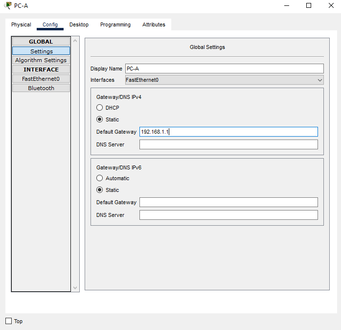
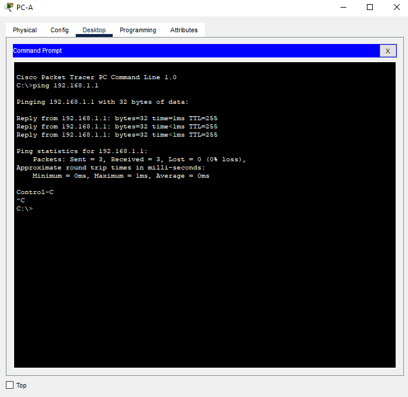
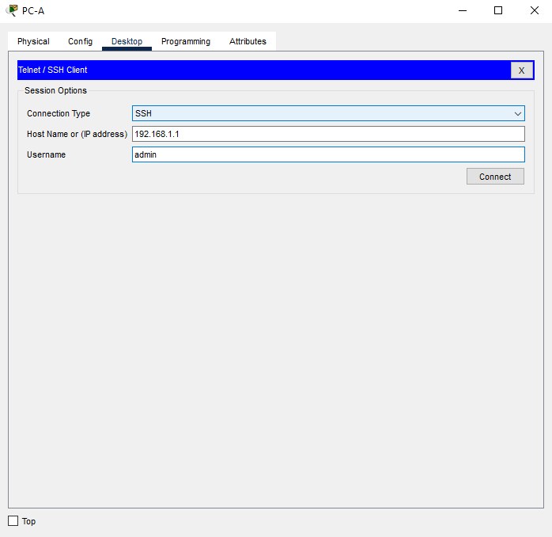
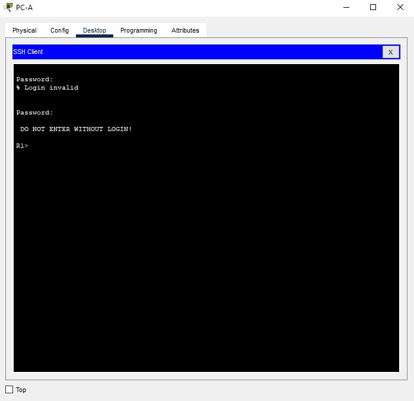
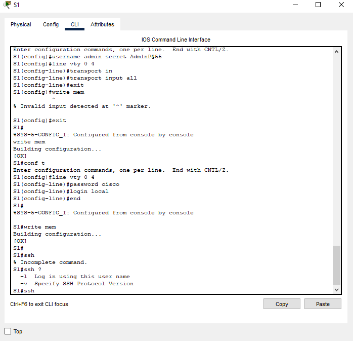
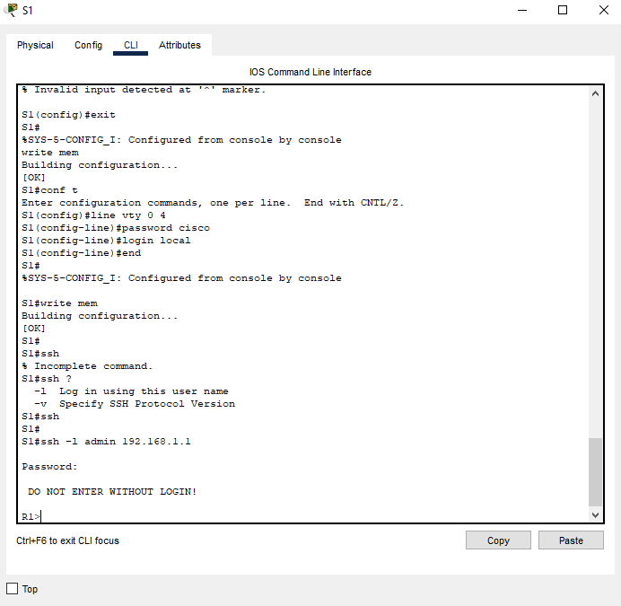
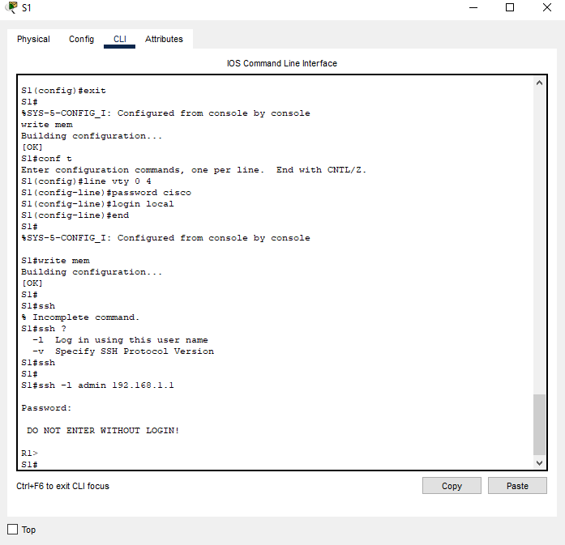
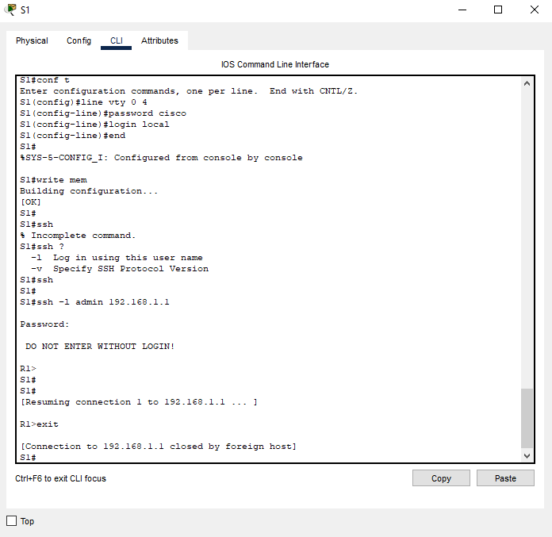

# Лабораторная работа. Доступ к сетевым устройствам по протоколу SSH

# Задачи

Часть 1. Настройка основных параметров устройства
Часть 2. Настройка маршрутизатора для доступа по протоколу SSH
Часть 3. Настройка коммутатора для доступа по протоколу SSH
Часть 4. SSH через интерфейс командной строки (CLI) коммутатора


# Топология


# Таблица адресации

| Устройство | Интерфейс | IP-адрес | Маска подсети | Шлюз по умолчанию |
| --- | --- | --- | --- | --- |
| R1  | G0/0/1 | 192.168.1.1 | 192.168.1.1 | —   |
| S1  | VLAN 1 | 192.168.1.11 | 255.255.255.0 | 192.168.1.1  |
| PC-A | NIC | 192.168.1.3 | 255.255.255.0 | 192.168.1.1  | 


# Часть 1. Настройка основных параметров устройств
В части 1 потребуется настроить топологию сети и основные параметры, такие как IP-адреса интерфейсов, доступ к устройствам и пароли на маршрутизаторе.
### Шаг 1. Создайте сеть согласно топологии.

Выполняем базовую настройку коммутатора
```shell
Switch>enable
Switch#configure terminal
Switch(config)#interface vlan 1
Switch(config-if)#ip address 192.168.1.11 255.255.255.0
Switch(config-if)#no shutdown
Switch(config-if)#exit
Switch(config)#hostname S1
S1(config)#end
S1#write memory
```
Выполняем базовую настройку маршрутизатора:
```shell
Router>enable
Router#configure terminal 
Router(config)#hostname R1
R1(config)#interface G0/0/1
R1(config-if)#ip address 192.168.1.1 255.255.255.0
R1(config-if)#no shutdown
R1(config-if)#end
R1#write memory
```
### Шаг 2. Выполните инициализацию и перезагрузку маршрутизатора и коммутатора.
```shell
R1#reload
```

```shell
S1#reload
```

### Шаг 3. Настройте маршрутизатор.
a.	Подключитесь к маршрутизатору с помощью консоли и активируйте привилегированный режим EXEC.
```shell
R1>enable
R1#
```
b.	Войдите в режим конфигурации.
```shell
R1#configure terminal
R1(config)#
```
c.	Отключите поиск DNS, чтобы предотвратить попытки маршрутизатора неверно преобразовывать введенные команды таким образом, как будто они являются именами узлов.
```shell
R1(config)#no ip domain-lookup
```

d.	Назначьте class в качестве зашифрованного пароля привилегированного режима EXEC.
```shell
R1(config)#enable secret class
```

e.	Назначьте cisco в качестве пароля консоли и включите вход в систему по паролю.
```shell
R1(config)#line console 0
R1(config-line)#password cisco
R1(config-line)#exit
```

f.	Назначьте cisco в качестве пароля VTY и включите вход в систему по паролю.
```shell
R1(config)#line vty 0 4
R1(config-line)#password cisco
R1(config-line)#exit
```
g.	Зашифруйте открытые пароли.
```shell
R1(config)#service password-encryption
R1(config)#end
R1#write mem
```

h.	Создайте баннер, который предупреждает о запрете несанкционированного доступа.
```shell
R1(config)#banner motd j DO NOT ENTER WITHOUT LOGIN! j
R1(config)#end
R1#write memory
```

i.	Настройте и активируйте на маршрутизаторе интерфейс G0/0/1, используя информацию, приведенную в таблице адресации.
```shell
R1(config)#interface G0/0/1
R1(config-if)#ip address 192.168.1.1 255.255.255.0
R1(config-if)#no shutdown
R1(config-if)#end
R1#write memory
```
j.	Сохраните текущую конфигурацию в файл загрузочной конфигурации.
```shell
R1(config-if)#end
R1#write memory
```

### Шаг 4. Настройте компьютер PC-A.
a.	Настройте для PC-A IP-адрес и маску подсети.


b.	Настройте для PC-A шлюз по умолчанию.


### Шаг 5. Проверьте подключение к сети.
Пошлите с PC-A команду Ping на маршрутизатор R1. Если эхо-запрос с помощью команды ping не проходит, найдите и устраните неполадки подключения.


# Часть 2. Настройка маршрутизатора для доступа по протоколу SSH

### Шаг 1. Настройте аутентификацию устройств.
При генерации ключа шифрования в качестве его части используются имя устройства и домен. Поэтому эти имена необходимо указать перед вводом команды crypto key.
Откройте окно конфигурации
a.	Задайте имя устройства.
```shell
R1(config)#hostname R1 
```

b.	Задайте домен для устройства.
```shell
R1(config)#ip domain-name homework5.otus.ru
```
### Шаг 2. Создайте ключ шифрования с указанием его длины.
```shell
R1(config)#crypto key generate rsa general-keys modulus 2048
The name for the keys will be: R1.homework5.otus.ru

% The key modulus size is 2048 bits
% Generating 2048 bit RSA keys, keys will be non-exportable...[OK]
*Mar 1 0:33:24.177: %SSH-5-ENABLED: SSH 1.99 has been enabled
```

### Шаг 3. Создайте имя пользователя в локальной базе учетных записей.
Настройте имя пользователя, используя admin в качестве имени пользователя и Adm1nP @55 в качестве пароля.
```shell
R1(config)#username admin secret Adm1nP@55
```
### Шаг 4. Активируйте протокол SSH на линиях VTY.
a.	Активируйте протоколы Telnet и SSH на входящих линиях VTY с помощью команды transport input.
```shell
R1(config)#line vty 0 4
R1(config-line)#transport input all
R1(config-line)#login local
R1(config-line)#end
```
b.	Измените способ входа в систему таким образом, чтобы использовалась проверка пользователей по локальной базе учетных записей.

```shell
R1(config-line)#login local
R1(config-line)#end
```

### Шаг 5. Сохраните текущую конфигурацию в файл загрузочной конфигурации.
```shell
R1#write memory
```

### Шаг 6. Установите соединение с маршрутизатором по протоколу SSH.
a.	Запустите Tera Term с PC-A.


b.	Установите SSH-подключение к R1. Use the username admin and password Adm1nP@55. У вас должно получиться установить SSH-подключение к R1.



# Часть 3. Настройка коммутатора для доступа по протоколу SSH
### Шаг 1. Настройте основные параметры коммутатора.
a.	Подключитесь к коммутатору с помощью консольного подключения и активируйте привилегированный режим EXEC.
```shell
S1>enable
S1#
```
b.	Войдите в режим конфигурации.
```shell
S1#configure terminal
Enter configuration commands, one per line.  End with CNTL/Z.
S1(config)#
```
c.	Отключите поиск DNS, чтобы предотвратить попытки маршрутизатора неверно преобразовывать введенные команды таким образом, как будто они являются именами узлов.
```shell
S1(config)#no ip domain-lookup
```
d.	Назначьте class в качестве зашифрованного пароля привилегированного режима EXEC.
```shell
S1(config)#enable secret class
```
e.	Назначьте cisco в качестве пароля консоли и включите вход в систему по паролю.
```shell
S1(config)#line console 0
S1(config-line)#password cisco
S1(config-line)#login local
```
f.	Назначьте cisco в качестве пароля VTY и включите вход в систему по паролю.
```shell
S1(config)#line vty 0 4
S1(config-line)#password cisco
S1(config-line)#login local
```
g.	Зашифруйте открытые пароли.
```shell
S1(config)#service password-encryption
```

h.	Создайте баннер, который предупреждает о запрете несанкционированного доступа.
```shell
S1(config)#banner motd j DO NOT ENTER WITHOUT LOGIN! j
S1(config)#end
S1#write memory
```

i.	Настройте и активируйте на коммутаторе интерфейс VLAN 1, используя информацию, приведенную в таблице адресации.
```shell
S1(config)#interface vlan 1
S1(config-if)#ip address 192.168.1.11 255.255.255.0
S1(config-if)#no shutdown
S1(config-if)#end
S1#write memory
```
j.	Сохраните текущую конфигурацию в файл загрузочной конфигурации.
```shell
S1(config-if)#end
S1#write memory
```
### Шаг 2. Настройте коммутатор для соединения по протоколу SSH.
Для настройки протокола SSH на коммутаторе используйте те же команды, которые применялись для аналогичной настройки маршрутизатора в части 2.
a.	Настройте имя устройства, как указано в таблице адресации.
```shell
S1(config)#hostname S1
```

b.	Задайте домен для устройства.
```shell
S1(config)#ip domain-name lab05.otus.ru
```
c.	Создайте ключ шифрования с указанием его длины.
```shell
S1(config)#crypto key generate rsa general-keys modulus 2048
The name for the keys will be: S1.lab05.otus.ru

% The key modulus size is 2048 bits
% Generating 2048 bit RSA keys, keys will be non-exportable...[OK]
*Mar 1 0:20:30.101: %SSH-5-ENABLED: SSH 1.99 has been enabled
```
d.	Создайте имя пользователя в локальной базе учетных записей.
```shell
S1(config)#username admin secret Adm1nP@55
```

e.	Активируйте протоколы Telnet и SSH на линиях VTY.
```shell
S1(config)#line vty 0 4
S1(config-line)#transport input all
S1(config-line)#exit
```
f.	Измените способ входа в систему таким образом, чтобы использовалась проверка пользователей по локальной базе учетных записей.
```shell
S1(config)#line vty 0 4
S1(config-line)#login local
S1(config-line)#end
S1#write memory
```

### Шаг 3. Установите соединение с коммутатором по протоколу SSH.
Запустите программу Tera Term на PC-A, затем установите подключение по протоколу SSH к интерфейсу SVI коммутатора S1.


Как видим, подключение прошло удачно

# Часть 4. Настройка протокола SSH с использованием интерфейса командной строки (CLI) коммутатора
Клиент SSH встроен в операционную систему Cisco IOS и может запускаться из интерфейса командной строки. В части 4 вам предстоит установить соединение с маршрутизатором по протоколу SSH, используя интерфейс командной строки коммутатора.

### Шаг 1. Посмотрите доступные параметры для клиента SSH в Cisco IOS.
Откройте окно конфигурации
Используйте вопросительный знак (?), чтобы отобразить варианты параметров для команды ssh


### Шаг 2. Установите с коммутатора S1 соединение с маршрутизатором R1 по протоколу SSH.
a.	Чтобы подключиться к маршрутизатору R1 по протоколу SSH, введите команду –l admin. Это позволит вам войти в систему под именем admin. При появлении приглашения введите в качестве пароля Adm1nP@55
S1# ssh -l admin 192.168.1.1
Password: 
Authorized Users Only!
R1>


b.	Чтобы вернуться к коммутатору S1, не закрывая сеанс SSH с маршрутизатором R1, нажмите комбинацию клавиш Ctrl+Shift+6. Отпустите клавиши Ctrl+Shift+6 и нажмите x. Отображается приглашение привилегированного режима EXEC коммутатора.
R1>
S1#


c.	Чтобы вернуться к сеансу SSH на R1, нажмите клавишу Enter в пустой строке интерфейса командной строки. Чтобы увидеть окно командной строки маршрутизатора, нажмите клавишу Enter еще раз.
S1#
[Resuming connection 1 to 192.168.1.1 ... ]


R1>
d.	Чтобы завершить сеанс SSH на маршрутизаторе R1, введите в командной строке маршрутизатора команду exit.
R1# exit

[Connection to 192.168.1.1 closed by foreign host]
S1#



