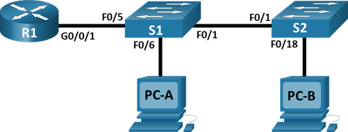
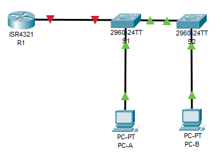
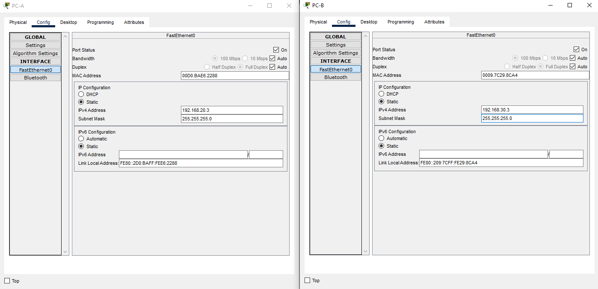
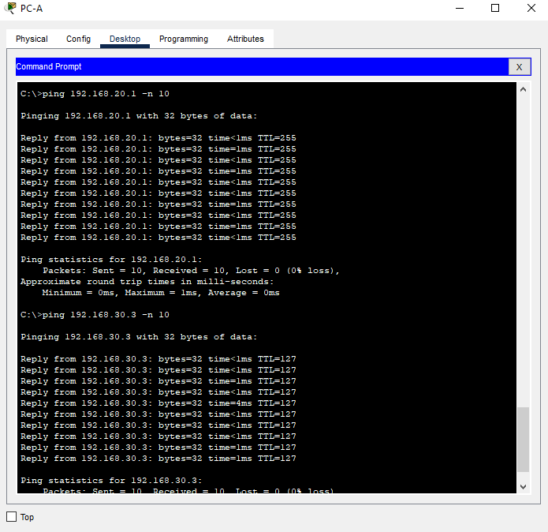
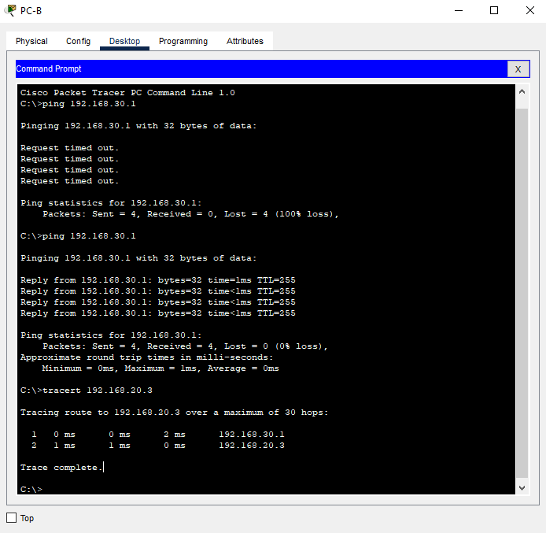

# Лабораторная работа. Внедрение маршрутизации между виртуальными локальными сетями

# Задачи

Часть 1. Создание сети и настройка основных параметров устройства
Часть 2. Создание сетей VLAN и назначение портов коммутатора
Часть 3. Настройка транка 802.1Q между коммутаторами.
Часть 4. Настройка маршрутизации между сетями VLAN
Часть 5. Проверка, что маршрутизация между VLAN работает


# Топология



# Таблица адресации

| Устройство | Интерфейс | IP-адрес | Маска подсети | Шлюз по умолчанию |
| --- | --- | --- | --- | --- |
| R1  | G0/0/1.10 | 192.168.10.1 | 255.255.255.0 | —   |
| R1  | G0/0/1.20 | 192.168.20.1 | 255.255.255.0 | —   |
| R1  | G0/0/1.30 | 192.168.30.1 | 255.255.255.0 | —   |
| R1  | G0/0/1.1000 | —   | —   | —   |
| S1  | VLAN 10 | 192.168.10.11 | 255.255.255.0 | 192.168.10.1 |
| S2  | VLAN 10 | 192.168.10.12 | 255.255.255.0 | 192.168.10.1 |
| PC-A | NIC | 192.168.20.3 | 255.255.255.0 | 192.168.20.1 |
| PC-B | NIC | 192.168.30.3 | 255.255.255.0 | 192.168.30.1 |

# Таблица VLAN

| VLAN | Имя | Назначенный интерфейс |
| --- | --- | --- |
| 10  | Управление | S1: VLAN 10<br><br>S2: VLAN 10 |
| 20  | Sales | S1: F0/6 |
| 30  | Operations | S2: F0/18 |
| 999 | Parking_Lot | С1: F0/2-4, F0/7-24, G0/1-2<br><br>С2: F0/2-17, F0/19-24, G0/1-2 |
| 1000 | Собственная | —   |


# Часть 1. Создание сети и настройка основных параметров устройства
В первой части лабораторной работы вам предстоит создать топологию сети и настроить базовые параметры для узлов ПК и коммутаторов.

### Шаг 1. Создайте сеть согласно топологии.
Подключите устройства, как показано в топологии, и подсоедините необходимые кабели.


### Шаг 2. Настройте базовые параметры для маршрутизатора.
a.	Подключитесь к маршрутизатору с помощью консоли и активируйте привилегированный режим EXEC.

```shell
Router>enable
```

Откройте окно конфигурации
b.	Войдите в режим конфигурации.
```shell
Router#configure terminal
```
c.	Назначьте маршрутизатору имя устройства.
```shell
Router(config)#hostname R1
```
d.	Отключите поиск DNS, чтобы предотвратить попытки маршрутизатора неверно преобразовывать введенные команды таким образом, как будто они являются именами узлов.

```shell
R1(config)#no ip domain lookup
```
e.	Назначьте class в качестве зашифрованного пароля привилегированного режима EXEC.
```shell
R1(config)#enable secret class
```
f.	Назначьте cisco в качестве пароля консоли и включите вход в систему по паролю.
```shell
R1(config)#line console 0
R1(config-line)#password cisco
R1(config-line)#login
R1(config-line)#exit
```
g.	Установите cisco в качестве пароля виртуального терминала и активируйте вход.
```shell
R1(config)#line vty 0 4
R1(config-line)#password cisco
R1(config-line)#login
R1(config-line)#exit
```
h.	Зашифруйте открытые пароли.
```shell
R1(config)#service password-encryption
```
i.	Создайте баннер с предупреждением о запрете несанкционированного доступа к устройству.
```shell
R1(config)#banner motd j DO NOT LOGIN WITHOUD PASSWORD! j
```
j.	Сохраните текущую конфигурацию в файл загрузочной конфигурации.
```shell
R1(config)#exit
R1#write mem
```
k.	Настройте на маршрутизаторе время.
```shell
R1#clock set 22:24:00 23 September 2025
R1#show clock 
22:24:15.158 UTC Tue Sep 23 2025
```

### Шаг 3. Настройте базовые параметры каждого коммутатора.
a.	Присвойте коммутатору имя устройства.
```shell
# На первом коммутаторе
Switch>enable
Switch#configure terminal
Switch(config)#hostname S1
S1(config)#end
S1#write memory
# На втором коммутаторе
Switch>enable
Switch#configure terminal
Switch(config)#hostname S2
S2(config)#end
S2#write memory
```
b.	Отключите поиск DNS, чтобы предотвратить попытки маршрутизатора неверно преобразовывать введенные команды таким образом, как будто они являются именами узлов.

```shell
# На первом коммутаторе
S1(config)#no ip domain lookup
# На втором коммутаторе
S2(config)#no ip domain lookup
```

c.	Назначьте class в качестве зашифрованного пароля привилегированного режима EXEC.
```shell
# На первом коммутаторе
S1(config)#enable secret class
# На втором коммутаторе
S2(config)#enable secret class
```

d.	Назначьте cisco в качестве пароля консоли и включите вход в систему по паролю.
```shell
# На первом коммутаторе
S1(config)#line console 0
S1(config-line)#password cisco
S1(config-line)#login
S1(config-line)#exit
# На втором коммутаторе
S2(config)#line console 0
S2(config-line)#password cisco
S2(config-line)#login
S2(config-line)#exit
```
e.	Установите cisco в качестве пароля виртуального терминала и активируйте вход.
```shell
# На первом коммутаторе
S1(config)#line vty 0 4
S1(config-line)#password cisco
S1(config-line)#login
S1(config-line)#exit
# На втором коммутаторе
S2(config)#line vty 0 4
S2(config-line)#password cisco
S2(config-line)#login
S2(config-line)#exit
```
f.	Зашифруйте открытые пароли.
```shell
# На первом коммутаторе
S1(config)#service password-encryption
# На втором коммутаторе
S2(config)#service password-encryption
```
g.	Создайте баннер с предупреждением о запрете несанкционированного доступа к устройству.
```shell
# На первом коммутаторе
S1(config)#banner motd j DO NOT LOGIN WITHOUT PASSWORD! j
# На втором коммутаторе
S2(config)#banner motd j DO NOT LOGIN WITHOUT PASSWORD! j
```
h.	Настройте на коммутаторах время.
```shell
# На первом коммутаторе
S1#clock set 22:43:00 23 September 2025
# На втором коммутаторе
S2#clock set 22:45:00 23 September 2025
```
i.	Сохранение текущей конфигурации в качестве начальной.
```shell
# На первом коммутаторе
S1#write memory
# На втором коммутаторе
S2#write memory
```

### Шаг 4. Настройте узлы ПК.
Адреса ПК можно посмотреть в таблице адресации.


# Часть 2. Создание сетей VLAN и назначение портов коммутатора
Во второй части вы создадите VLAN, как указано в таблице выше, на обоих коммутаторах. Затем вы назначите VLAN соответствующему интерфейсу и проверите настройки конфигурации. Выполните следующие задачи на каждом коммутаторе.

### Шаг 1. Создайте сети VLAN на коммутаторах.
a.	Создайте и назовите необходимые VLAN на каждом коммутаторе из таблицы выше.
Откройте окно конфигурации

```shell
# На первом коммутаторе
S1(config)#vlan 10
S1(config-vlan)#name control
S1(config-vlan)#end

S1(config)#vlan 20
S1(config-vlan)#name Sales
S1(config-vlan)#exit
S1(config)#vlan 30
S1(config-vlan)#name Operations
S1(config-vlan)#exit
S1(config)#vlan 999
S1(config-vlan)#name Parking_Lot
S1(config-vlan)#exit

# На втором коммутаторе

S2(config)#vlan 10
S2(config-vlan)#name control
S2(config-vlan)#exit
S2(config)#vlan 20
S2(config-vlan)#name Sales
S2(config-vlan)#exit
S2(config)#vlan 30
S2(config-vlan)#name Operations
S2(config-vlan)#exit
S2(config)#vlan 999
S2(config-vlan)#name Parking_Lot
S2(config-vlan)#exit
S2(config)#exit
```


b.	Настройте интерфейс управления и шлюз по умолчанию на каждом коммутаторе, используя информацию об IP-адресе в таблице адресации.
```shell
# На первом коммутаторе
S1(config)#interface vlan 10
S1(config-if)#ip address 192.168.10.11 255.255.255.0
S1(config-if)#no shutdown
S1(config-if)#exit

# На втором коммутаторе
S2(config-if)#ip address 192.168.10.12 255.255.255.0
S2(config-if)#no shutdown
S2(config-if)#exit
S2(config)#ip default-gateway 192.168.10.1
```

c.	Назначьте все неиспользуемые порты коммутатора VLAN Parking_Lot, настройте их для статического режима доступа и административно деактивируйте их.
Примечание. Команда interface range полезна для выполнения этой задачи с минимальным количеством команд.
```shell
# На первом коммутаторе
S1(config)#interface range fa0/2-4, fa0/7-24, gi0/1-2
S1(config-if-range)#switchport mode access
S1(config-if-range)#switchport access vlan 999
S1(config-if-range)#shutdown
S1(config-if-range)#end
S1#write mem

# На втором коммутаторе
S2(config)#interface range fa0/2-17,fa0/19-24,gi0/1-2
S2(config-if-range)#switchport mode access 
S2(config-if-range)#switchport access vlan 999
S2(config-if-range)#shutdown
S2(config-if-range)#end
S2#write mem
```

### Шаг 2. Назначьте сети VLAN соответствующим интерфейсам коммутатора.
a.	Назначьте используемые порты соответствующей VLAN (указанной в таблице VLAN выше) и настройте их для режима статического доступа.

```shell
# На первом коммутаторе
S1(config)#interface fa0/6
S1(config-if-range)#switchport mode access
S1(config-if)#switchport access vlan 20
S1(config-if)#no shutdown
S1(config)#end
S1#write mem

# На втором коммутаторе
S2(config)#interface fa0/18
S2(config-if)#switchport mode access
S2(config-if)#switchport access vlan 30
S2(config-if)#end
S2#write mem
```

b.	Убедитесь, что VLAN назначены на правильные интерфейсы.

```shell
# На первом коммутаторе
S1#show vlan brief

1    default                          active    Fa0/1, Fa0/5
10   control                          active    
20   Sales                            active    Fa0/6
30   Operations                       active    
999  Parking_Lot                      active    Fa0/2, Fa0/3, Fa0/4, Fa0/7
                                                Fa0/8, Fa0/9, Fa0/10, Fa0/11
                                                Fa0/12, Fa0/13, Fa0/14, Fa0/15
                                                Fa0/16, Fa0/17, Fa0/18, Fa0/19
                                                Fa0/20, Fa0/21, Fa0/22, Fa0/23
                                                Fa0/24, Gig0/1, Gig0/2
1002 fddi-default                     active    
1003 token-ring-default               active    
1004 fddinet-default                  active    
1005 trnet-default                    active   

# На втором коммутаторе
S2#show vlan brief

VLAN Name                             Status    Ports
---- -------------------------------- --------- -------------------------------
1    default                          active    Fa0/1
10   control                          active    
20   Sales                            active    
30   Operations                       active    Fa0/18
999  Parking_Lot                      active    Fa0/2, Fa0/3, Fa0/4, Fa0/5
                                                Fa0/6, Fa0/7, Fa0/8, Fa0/9
                                                Fa0/10, Fa0/11, Fa0/12, Fa0/13
                                                Fa0/14, Fa0/15, Fa0/16, Fa0/17
                                                Fa0/19, Fa0/20, Fa0/21, Fa0/22
                                                Fa0/23, Fa0/24, Gig0/1, Gig0/2
1002 fddi-default                     active    
1003 token-ring-default               active    
1004 fddinet-default                  active    
1005 trnet-default                    active
```

# Часть 3. Конфигурация магистрального канала стандарта 802.1Q между коммутаторами
В части 3 вы вручную настроите интерфейс F0/1 как транк.

### Шаг 1. Вручную настройте магистральный интерфейс F0/1 на коммутаторах S1 и S2.
a.	Настройка статического транкинга на интерфейсе F0/1 для обоих коммутаторов.
Откройте окно конфигурации
b.	Установите native VLAN 1000 на обоих коммутаторах.
c.	Укажите, что VLAN 10, 20, 30 и 1000 могут проходить по транку.
d.	Проверьте транки, native VLAN и разрешенные VLAN через транк.

```shell
# На первом коммутаторе
S1(config)#vlan 1000
S1(config-vlan)#name NATIVE
S1(config-vlan)#exit
S1(config)#interface fa0/1
S1(config-if)#switchport mode trunk 
S1(config-if)#switchport trunk native vlan 1000
S1(config-if)#switchport trunk allowed vlan 10,20,30,1000
S1(config-if)#end
S1#write mem
S1(config)#do show interfaces trunk
Port        Mode         Encapsulation  Status        Native vlan
Fa0/1       on           802.1q         trunking      1000

Port        Vlans allowed on trunk
Fa0/1       10,20,30,1000

Port        Vlans allowed and active in management domain
Fa0/1       10,20,30,1000

Port        Vlans in spanning tree forwarding state and not pruned
Fa0/1       10,20,30,1000

# На втором коммутаторе
S2(config)#vlan 1000
S2(config-vlan)#name NATIVE
S2(config-vlan)#exit
S2(config)#interface fa0/1
S2(config-if)#switchport mode trunk
S2(config-if)#switchport trunk native vlan 1000
S2(config-if)#switchport trunk allowed vlan 10,20,30,1000
S2(config-if)#end
S2#write mem
S2(config)#do show interfaces trunk
Port        Mode         Encapsulation  Status        Native vlan
Fa0/1       on           802.1q         trunking      1000

Port        Vlans allowed on trunk
Fa0/1       10,20,30,1000

Port        Vlans allowed and active in management domain
Fa0/1       10,20,30,1000

Port        Vlans in spanning tree forwarding state and not pruned
Fa0/1       10,20,30,1000
```

#Шаг 2. Вручную настройте магистральный интерфейс F0/5 на коммутаторе S1.
a.	Настройте интерфейс S1 F0/5 с теми же параметрами транка, что и F0/1. Это транк до маршрутизатора.
b.	Сохраните текущую конфигурацию в файл загрузочной конфигурации.
c.	Проверка транкинга.
Вопрос:
Что произойдет, если G0/0/1 на R1 будет отключен?

```shell
S1(config)#interface fa0/5
S1(config-if)#switchport mode trunk
S1(config-if)#switchport trunk native vlan 1000
S1(config-if)#switchport trunk allowed vlan 10,20,30,1000
S1(config-if)#end
S1#write mem

S1#show interfaces trunk
Port        Mode         Encapsulation  Status        Native vlan
Fa0/1       on           802.1q         trunking      1000

Port        Vlans allowed on trunk
Fa0/1       10,20,30,1000

Port        Vlans allowed and active in management domain
Fa0/1       10,20,30,1000

Port        Vlans in spanning tree forwarding state and not pruned
Fa0/1       10,20,30,1000
```

Транк на FastEthernet 0/5 не активировался, вероятно из-за отключенного порта GigabitEthernet 0/0/1.

# Часть 4. Настройка маршрутизации между сетями VLAN
### Шаг 1. Настройте маршрутизатор.
Откройте окно конфигурации
a.	При необходимости активируйте интерфейс G0/0/1 на маршрутизаторе.

```shell
R1(config)#interface GigabitEthernet 0/0/1
R1(config-if)#no shutdown
R1(config)#end
R1#write memory

```

b.	Настройте подинтерфейсы для каждой VLAN, как указано в таблице IP-адресации. Все подинтерфейсы используют инкапсуляцию 802.1Q. Убедитесь, что подинтерфейсу для native VLAN не назначен IP-адрес. Включите описание для каждого подинтерфейса.
c.	Убедитесь, что вспомогательные интерфейсы работают

```shell
R1(config)#interface gigabitEthernet 0/0/1.10
R1(config-subif)#description Default GW for VLAN 10
R1(config-subif)#encapsulation dot1Q 10
R1(config-subif)#ip address 192.168.10.1 255.255.255.0
R1(config-subif)#exit
R1(config)#interface gigabitEthernet 0/0/1.20
R1(config-subif)#description Default GW for VLAN 20
R1(config-subif)#encapsulation dot1Q 20
R1(config-subif)#ip address 192.168.20.1 255.255.255.0
R1(config-subif)#exit
R1(config)#interface gigabitEthernet 0/0/1.30
R1(config-subif)#description Default GW for VLAN 30
R1(config-subif)#encapsulation dot1Q 30
R1(config-subif)#ip address 192.168.30.1 255.255.255.0
R1(config-subif)#exit
R1(config)#interface gigabitEthernet 0/0/1.1000
R1(config-subif)#description Default GW for VLAN 1000
R1(config-subif)#encapsulation dot1Q 
R1(config-subif)#encapsulation dot1Q 1000
R1(config)#end
R1#write mem

R1#show interfaces 
GigabitEthernet0/0/0 is administratively down, line protocol is down (disabled)
  Hardware is Lance, address is 0001.6454.0301 (bia 0001.6454.0301)
  MTU 1500 bytes, BW 1000000 Kbit, DLY 10 usec,
     reliability 255/255, txload 1/255, rxload 1/255
  Encapsulation ARPA, loopback not set
  Full-duplex, 100Mb/s, media type is RJ45
  ARP type: ARPA, ARP Timeout 04:00:00, 
  Last input 00:00:08, output 00:00:05, output hang never
  Last clearing of "show interface" counters never
  Input queue: 0/75/0 (size/max/drops); Total output drops: 0
  Queueing strategy: fifo
  Output queue :0/40 (size/max)
  5 minute input rate 0 bits/sec, 0 packets/sec
  5 minute output rate 0 bits/sec, 0 packets/sec
     0 packets input, 0 bytes, 0 no buffer
     Received 0 broadcasts, 0 runts, 0 giants, 0 throttles
     0 input errors, 0 CRC, 0 frame, 0 overrun, 0 ignored, 0 abort
     0 input packets with dribble condition detected
     0 packets output, 0 bytes, 0 underruns
     0 output errors, 0 collisions, 2 interface resets
     0 babbles, 0 late collision, 0 deferred
     0 lost carrier, 0 no carrier
     0 output buffer failures, 0 output buffers swapped out
GigabitEthernet0/0/1 is up, line protocol is up (connected)
  Hardware is Lance, address is 0001.6454.0302 (bia 0001.6454.0302)
  MTU 1500 bytes, BW 1000000 Kbit, DLY 100 usec,
     reliability 255/255, txload 1/255, rxload 1/255
  Encapsulation ARPA, loopback not set
  Full-duplex, 100Mb/s, media type is RJ45
  ARP type: ARPA, ARP Timeout 04:00:00, 
  Last input 00:00:08, output 00:00:05, output hang never
  Last clearing of "show interface" counters never
  Input queue: 0/75/0 (size/max/drops); Total output drops: 0
  Queueing strategy: fifo
  Output queue :0/40 (size/max)
  5 minute input rate 0 bits/sec, 0 packets/sec
  5 minute output rate 0 bits/sec, 0 packets/sec
     0 packets input, 0 bytes, 0 no buffer
     Received 0 broadcasts, 0 runts, 0 giants, 0 throttles
     0 input errors, 0 CRC, 0 frame, 0 overrun, 0 ignored, 0 abort
     0 input packets with dribble condition detected
     0 packets output, 0 bytes, 0 underruns
     0 output errors, 0 collisions, 2 interface resets
     0 babbles, 0 late collision, 0 deferred
     0 lost carrier, 0 no carrier
     0 output buffer failures, 0 output buffers swapped out
GigabitEthernet0/0/1.10 is up, line protocol is up (connected)
  Hardware is PQUICC_FEC, address is 0001.6454.0302 (bia 0001.6454.0302)
  Internet address is 192.168.10.1/24
  MTU 1500 bytes, BW 100000 Kbit, DLY 100 usec, 
     reliability 255/255, txload 1/255, rxload 1/255
  Encapsulation 802.1Q Virtual LAN, Vlan ID 10
  ARP type: ARPA, ARP Timeout 04:00:00, 
  Last clearing of "show interface" counters never
GigabitEthernet0/0/1.20 is up, line protocol is up (connected)
  Hardware is PQUICC_FEC, address is 0001.6454.0302 (bia 0001.6454.0302)
  Internet address is 192.168.20.1/24
  MTU 1500 bytes, BW 100000 Kbit, DLY 100 usec, 
     reliability 255/255, txload 1/255, rxload 1/255
  Encapsulation 802.1Q Virtual LAN, Vlan ID 20
  ARP type: ARPA, ARP Timeout 04:00:00, 
  Last clearing of "show interface" counters never
GigabitEthernet0/0/1.30 is up, line protocol is up (connected)
  Hardware is PQUICC_FEC, address is 0001.6454.0302 (bia 0001.6454.0302)
  Internet address is 192.168.30.1/24
  MTU 1500 bytes, BW 100000 Kbit, DLY 100 usec, 
     reliability 255/255, txload 1/255, rxload 1/255
  Encapsulation 802.1Q Virtual LAN, Vlan ID 30
  ARP type: ARPA, ARP Timeout 04:00:00, 
  Last clearing of "show interface" counters never
GigabitEthernet0/0/1.1000 is up, line protocol is up (connected)
  Hardware is PQUICC_FEC, address is 0001.6454.0302 (bia 0001.6454.0302)
  MTU 1500 bytes, BW 100000 Kbit, DLY 100 usec, 
     reliability 255/255, txload 1/255, rxload 1/255
  Encapsulation 802.1Q Virtual LAN, Vlan ID 1000
  ARP type: ARPA, ARP Timeout 04:00:00, 
  Last clearing of "show interface" counters never
Vlan1 is administratively down, line protocol is down
  Hardware is CPU Interface, address is 0006.2a13.17b1 (bia 0006.2a13.17b1)
  MTU 1500 bytes, BW 100000 Kbit, DLY 1000000 usec,
     reliability 255/255, txload 1/255, rxload 1/255
  Encapsulation ARPA, loopback not set
  ARP type: ARPA, ARP Timeout 04:00:00
  Last input 21:40:21, output never, output hang never
  Last clearing of "show interface" counters never
  Input queue: 0/75/0/0 (size/max/drops/flushes); Total output drops: 0
  Queueing strategy: fifo
  Output queue: 0/40 (size/max)
  5 minute input rate 0 bits/sec, 0 packets/sec
  5 minute output rate 0 bits/sec, 0 packets/sec
     1682 packets input, 530955 bytes, 0 no buffer
     Received 0 broadcasts (0 IP multicast)
     0 runts, 0 giants, 0 throttles
     0 input errors, 0 CRC, 0 frame, 0 overrun, 0 ignored
     563859 packets output, 0 bytes, 0 underruns
     0 output errors, 23 interface resets
     0 output buffer failures, 0 output buffers swapped out


```

# Часть 5. Проверьте, работает ли маршрутизация между VLAN
### Шаг 1. Выполните следующие тесты с PC-A. Все должно быть успешно.
Примечание. Возможно, вам придется отключить брандмауэр ПК для работы ping  
a.	Отправьте эхо-запрос с PC-A на шлюз по умолчанию.  
b.	Отправьте эхо-запрос с PC-A на PC-B.  

c.	Отправьте команду ping с компьютера PC-A на коммутатор S2.


### Шаг 2. Пройдите следующий тест с PC-B
В окне командной строки на PC-B выполните команду tracert на адрес PC-A.
Вопрос:
Какие промежуточные IP-адреса отображаются в результатах?



Как видно, при отправке пакета из VLAN 30 на хост из VLAN 20, сначала запрос отправляется на шлюз VLAN 30 (192.168.30.1), а уже потом пакет перенаправляется на хост 192.168.20.3


